# ECE444-F2023-Lab1

## Author: Sebastian Czyrny

This is a clone of https://github.com/miguelgrinberg/flasky

## Activity 1

Screenshot of successful install of venv and flask

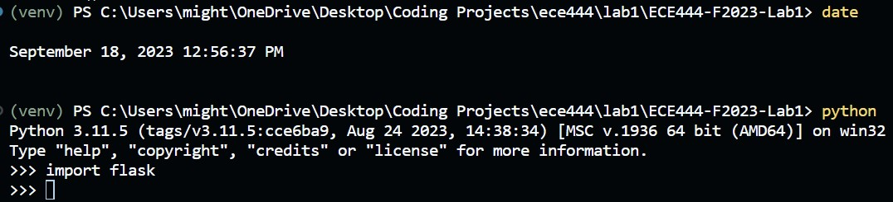

## Activity 2

Screenshot of commits relating to completion of examples 2-1 and 2-2

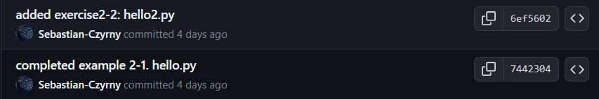

Screenshot of Hello, Sebastian

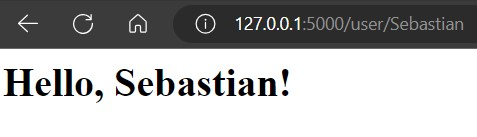

## Activity 3

Screenshot of commit relating to integration of flask moment

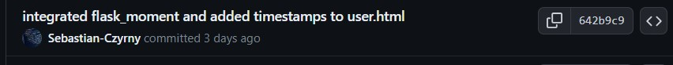

Screenshot of page with Boostrap and Moment integrated

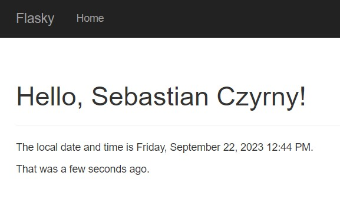

## Activity 4

Screenshots of activity 4

1. Screenshot of commits showing completion of steps 1 and 2

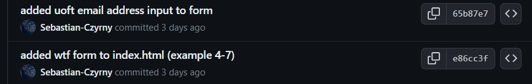

2. Screenshot of form

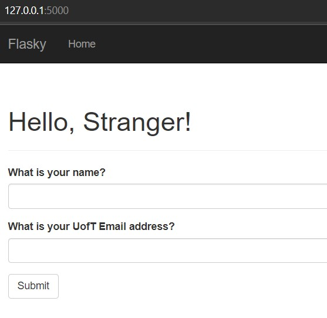

3. Screenshot of form submitted

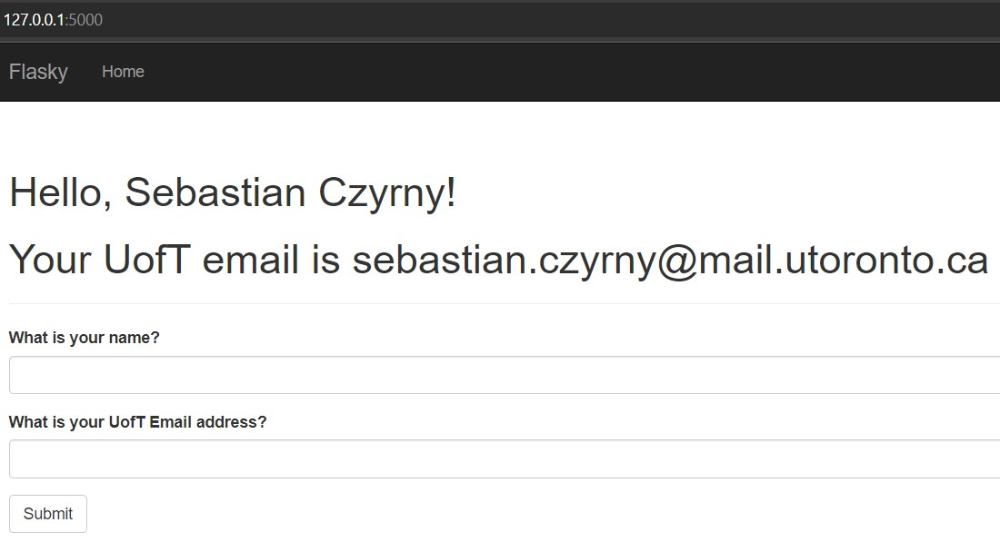

4. Screenshot of email validation error

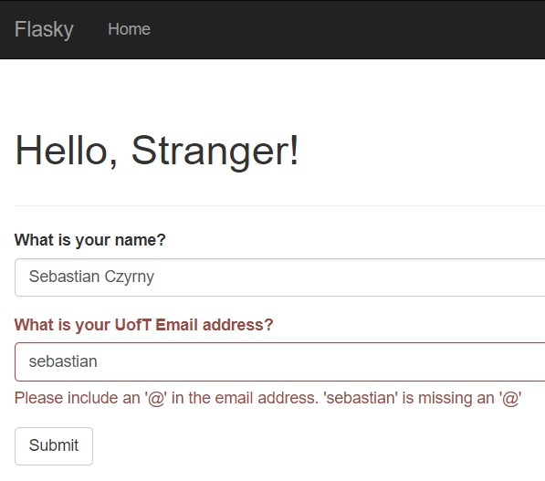

5. Screenshot of non-UofT email address

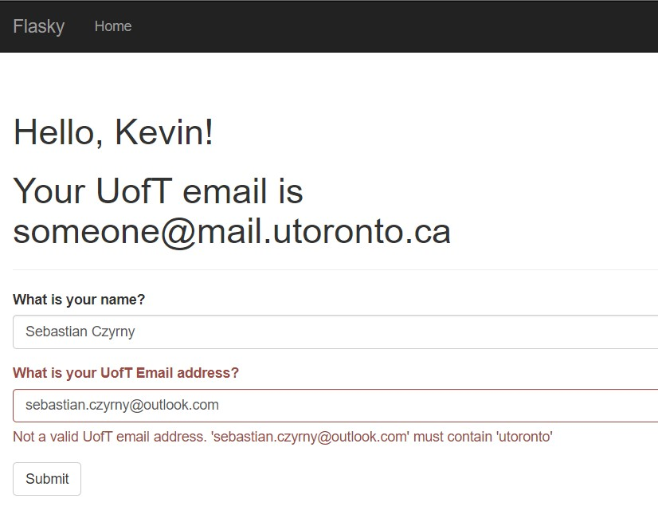

### Extra
Screenshot of flash messages upon successful update

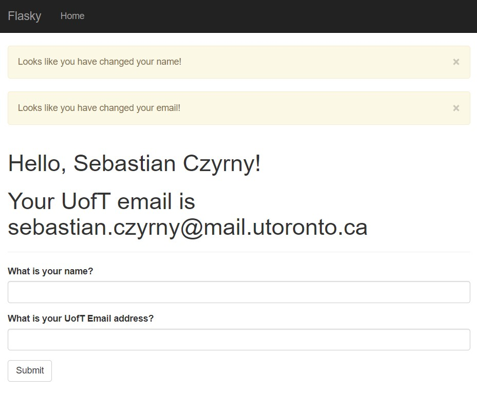