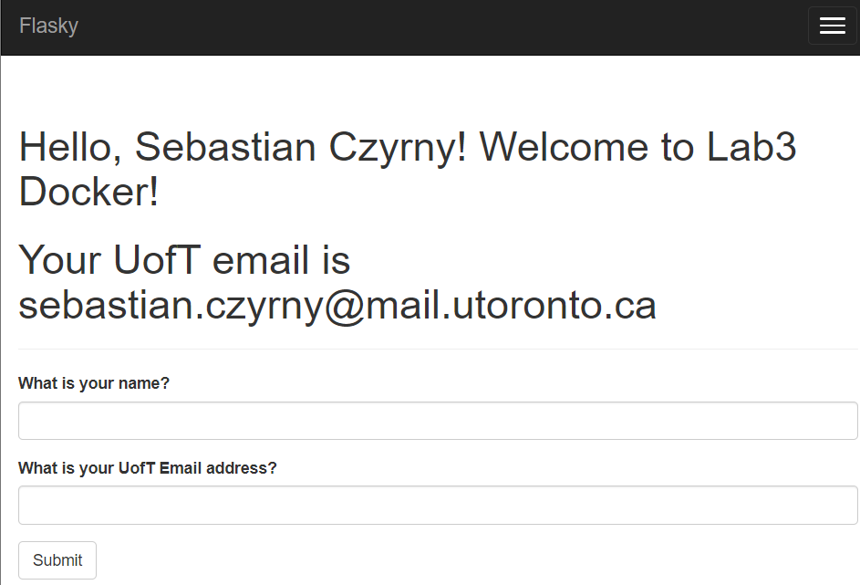

# Lab 3

## Author: Sebastian Czyrny

# Activity 2: Installing Docker

The below is a screenshot of the successful installation of docker

# Activity 3: Running locally

The below is a screenshot of running the flask application locally

