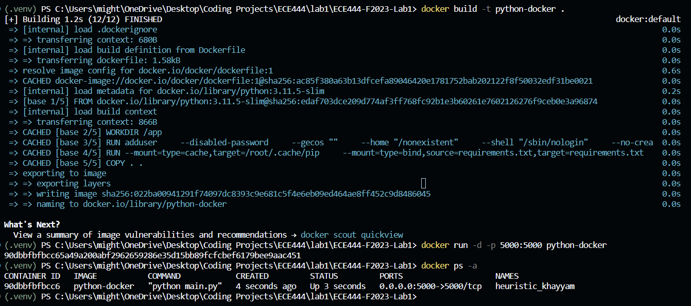
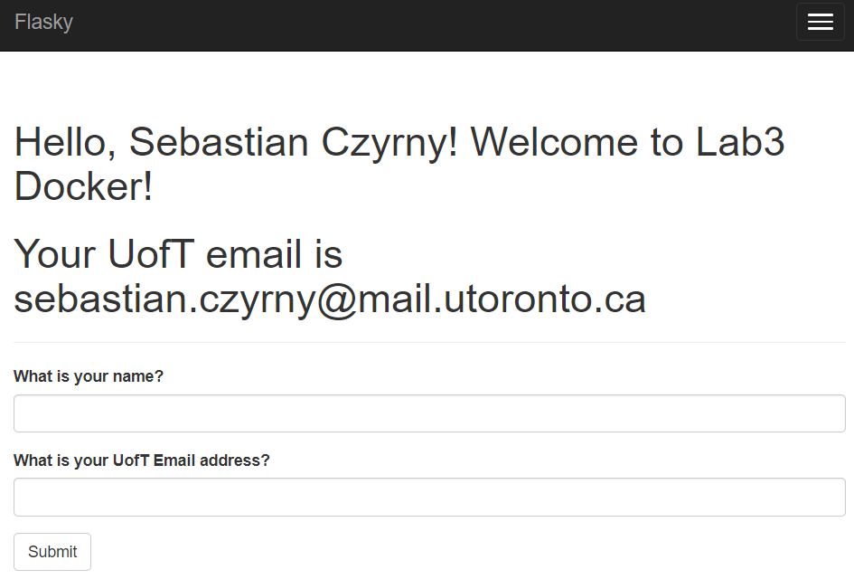
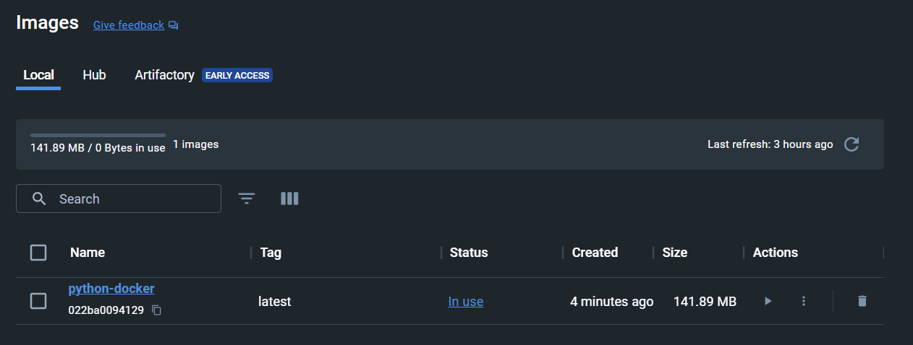
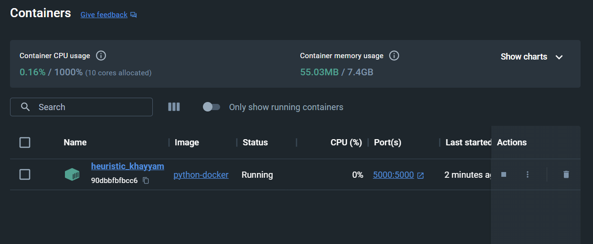

# Lab 3

## Author: Sebastian Czyrny

# Activity 2: Installing Docker

The below is a screenshot of the successful installation of docker

# Activity 3: Running locally

The below is a screenshot of running the flask application locally

# Activity 4: Docker Image

The below is an image of the output of running the docker commands:

The below is an image of the site running on http://localhost:5000

## Extra: Docker Application Image + Container

The below is an image of the image in the docker application

The below is an image of the container in the docker application

